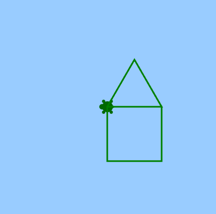
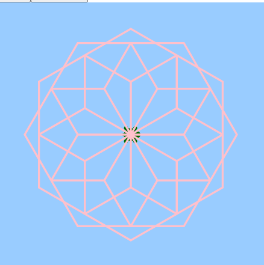
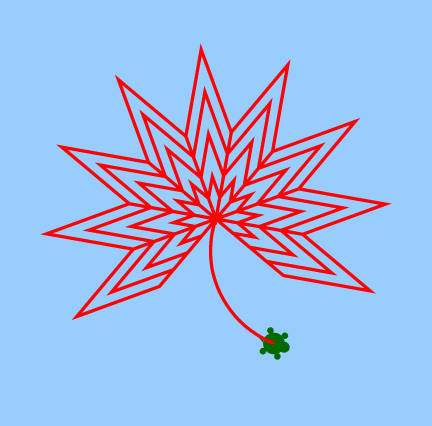
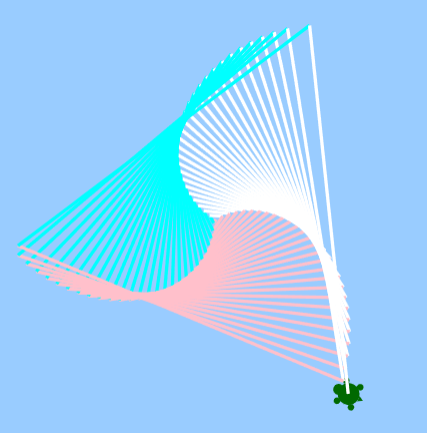

# Python For Kids
## Introduction
In this lesson, kids can learn how to program some interesting paintings with mobilechelonian of Turtle.
And learn following programming skills: 
1. For loop
2. Function
3. Variable
4. Flow control
## [mobilechelonian](https://pypi.org/project/mobilechelonian/)
This is a Turtle module for the Jupyter Notebook. It’s based on code by aspidites, one of two groups at Macewan University that built Turtle as a class assignment (the other was PACattack; I could have based this on either, but I had to pick one).
## Graphics
1. House 

2. Flower 

3. Maple Leaf 

4. [Amazing Spiral](https://twitter.com/clcoding/status/1563370121552220161/photo/1)
 

